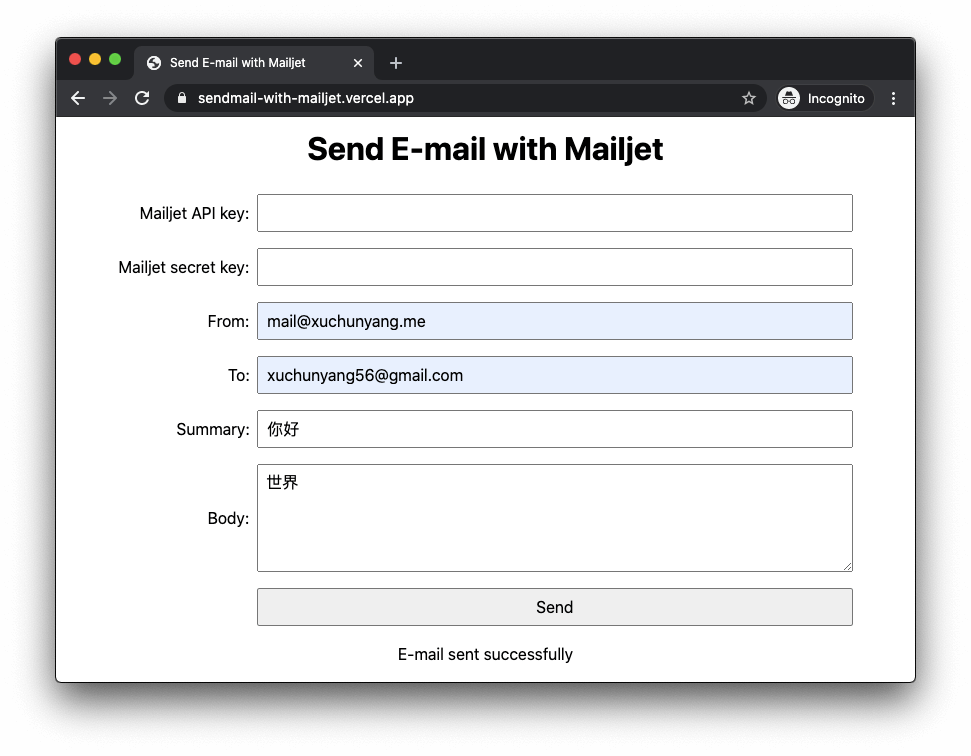

# Send E-mail with Mailjet

https://sendmail-with-mailjet.vercel.app/



## API

Send the following JSON to https://sendmail-with-mailjet.vercel.app/api/sendmail

``` json
{
  "key": "Mailjet API key",
  "secret": "Mailjet secret key",
  "from": "from@example.com",
  "to": "to@example.com",
  "summary": "the subject",
  "body": "the body"
}
```

## Privacy

I don't store logs.
